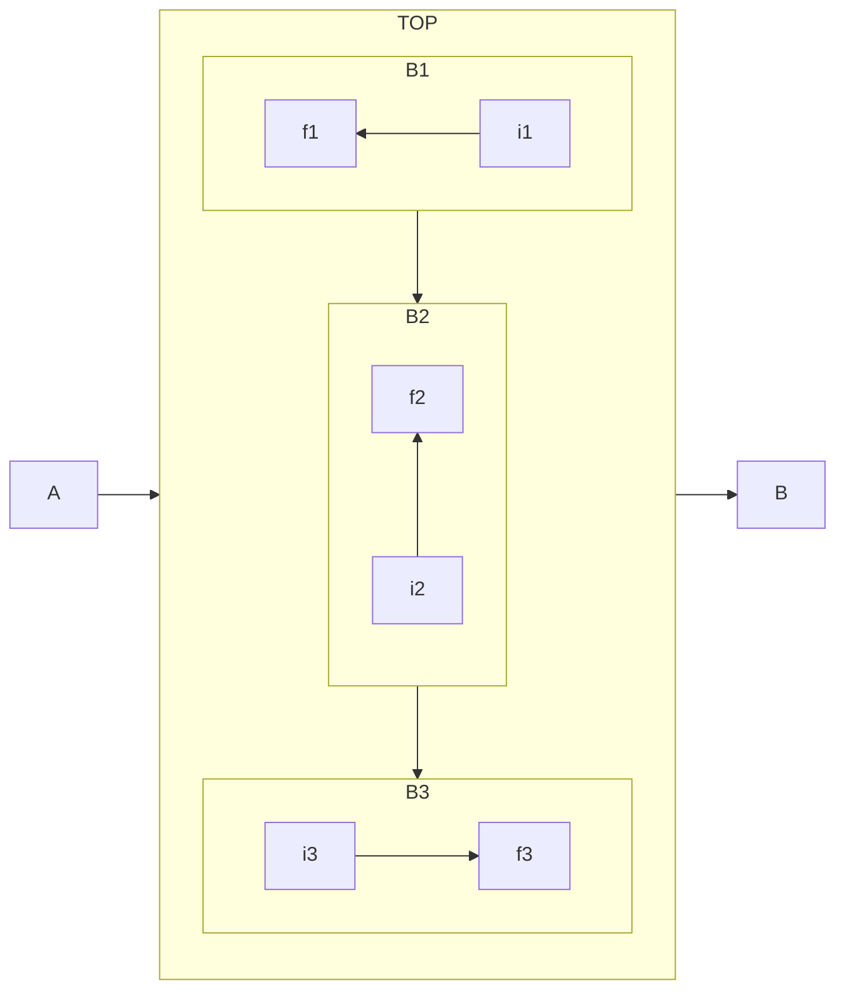
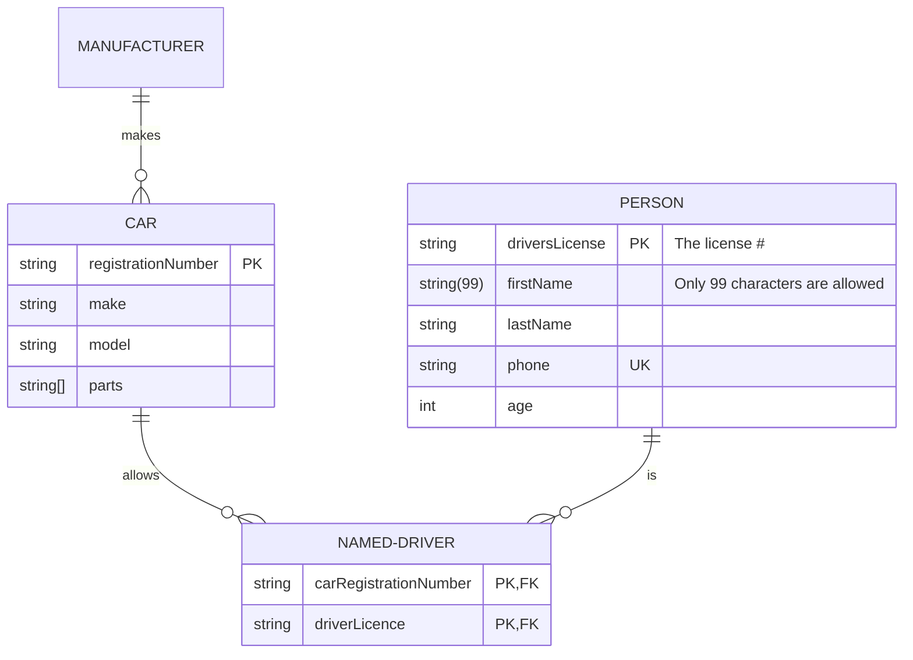
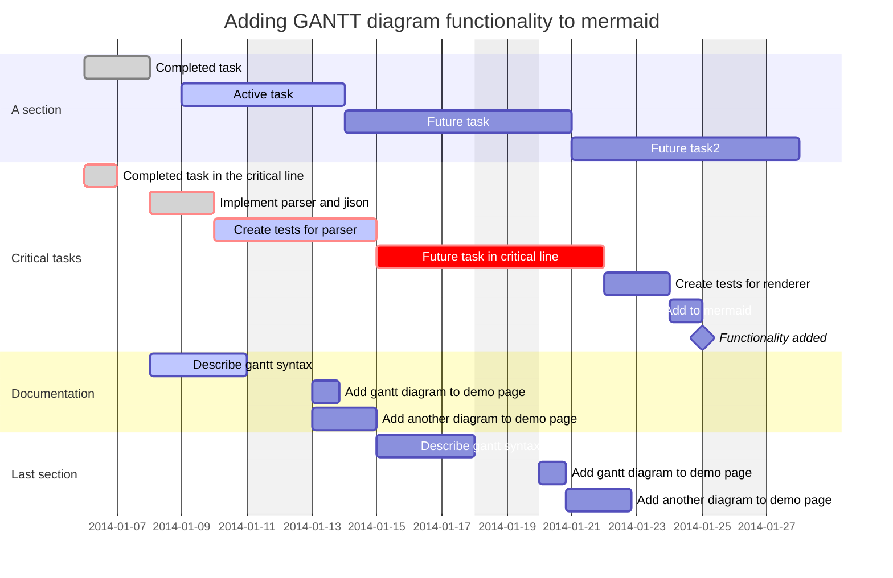
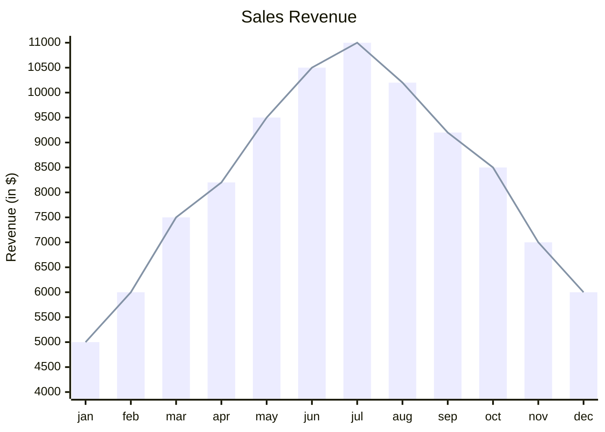
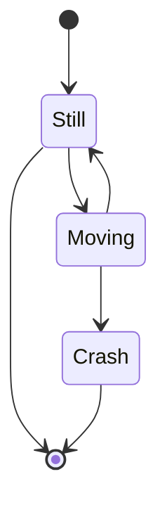

# Wonderful Markdown🍎🍏🍎🍏🍺🍎🍏🍎🍏🍺

Markdown内容渲染样例

## KateX公式语法 $x·y·z$

行内公式: $E = mc^2$

块级公式:

$$
\frac{n!}{k!(n-k)!} = \binom{n}{k}
$$

$$
x+y^{2x} \tag{hi}
$$

$$\fcolorbox{red}{yellow}{$复习\approx度蜜月$}$$

$$20000\text{\textasciitilde}30000$$

$$f(x)=\frac{1}{\sqrt{2\pi}\sigma}e^{-\frac{(x - \mu)^2}{2\sigma^2}}$$

$$P(B_j|A)=\frac{P(B_j)P(A|B_j)}{\sum_{i = 1}^{n}P(B_i)P(A|B_i)}$$


$$\frac{\partial F}{\partial y}-\frac{d}{dx}(\frac{\partial F}{\partial y'}) = 0$$

$$\rho(\frac{\partial \mathbf{v}}{\partial t}+\mathbf{v}\cdot\nabla\mathbf{v})=-\nabla p + \mu\nabla^2\mathbf{v}+\mathbf{f}$$

$$\zeta(s)=\sum_{n = 1}^{\infty}\frac{1}{n^s}=\prod_{p}\frac{1}{1 - p^{-s}}$$

$$G_{\mu\nu}=R_{\mu\nu}-\frac{1}{2}Rg_{\mu\nu}=\frac{8\pi G}{c^4}T_{\mu\nu}$$

$$D_{\mu}F^{\mu\nu}=J^{\nu}$$

$$J_{n - 1}(x)+J_{n + 1}(x)=\frac{2n}{x}J_n(x)$$

$$\Gamma(z)=\int_{0}^{\infty}t^{z - 1}e^{-t}dt,\text{Re}(z)>0$$

$$e^A=\sum_{n = 0}^{\infty}\frac{1}{n!}A^n$$

$$
\left\{\begin{array}{ll}
\nabla\cdot\mathbf{E}=\frac{\rho}{\epsilon_0} & \quad(1)\\
\nabla\cdot\mathbf{B} = 0 & \quad(2)\\
\nabla\times\mathbf{E}=-\frac{\partial\mathbf{B}}{\partial t} & \quad(3)\\
\nabla\times\mathbf{B}=\mu_0\mathbf{J}+\mu_0\epsilon_0\frac{\partial\mathbf{E}}{\partial t} & \quad(4)
\end{array}\right.
$$

$$
\left.\begin{array}{l}
(1)\quad-\frac{\hbar^2}{2m}\nabla^2\psi(\mathbf{r})+V(\mathbf{r})\psi(\mathbf{r}) = E\psi(\mathbf{r})\\
(2)\quad i\hbar\frac{\partial\Psi(\mathbf{r},t)}{\partial t}=-\frac{\hbar^2}{2m}\nabla^2\Psi(\mathbf{r},t)+V(\mathbf{r},t)\Psi(\mathbf{r},t)
\end{array}\right\}
$$

$$
\begin{cases}
-\frac{\hbar^2}{2m}\nabla^2\psi(\mathbf{r})+V(\mathbf{r})\psi(\mathbf{r}) = E\psi(\mathbf{r}) & \quad(1)\\
i\hbar\frac{\partial\Psi(\mathbf{r},t)}{\partial t}=-\frac{\hbar^2}{2m}\nabla^2\Psi(\mathbf{r},t)+V(\mathbf{r},t)\Psi(\mathbf{r},t) & \quad(2)
\end{cases}
$$

## Mermaid 图表
### 流程图


### 时序图
```mermaid
sequenceDiagram title 颜色参考 https://playdos.com/hexrgb/
    autonumber
    box LightGreen
    participant web as Web Browser
    end
    box LightGray
    participant blog as Blog Service
    end
    box Tomato
    participant account as Account Service
    end
    box DarkOrchid
    participant mail as Mail Service
    end
    box White
    participant db as Storage
    end
    
    Note over web,db: The user must be logged in to submit blog posts
    web->>+account: Logs in using credentials
    account->>db: Query stored accounts
    db->>account: Respond with query result

    alt Credentials not found
        account->>web: Invalid credentials
    else Credentials found
        account->>-web: Successfully logged in

        Note over blog,mail: When the user is authenticated, they can now submit new posts
        web->>+blog: Submit new post
        loop D8GER
            blog->>blog: Hello, DJ F**Ker!
        end
        Note right of blog: Rational thoughts <br/>prevail!
        blog->>db: Store post data

        par Notifications
            blog--)mail: Send mail to blog subscribers
            blog--)db: Store in-site notifications
        and Response
            blog-->>-web: Successfully posted
        end
    end
  ```

### 象限图
```mermaid
quadrantChart
    title Reach and engagement of campaigns
    x-axis Low Reach --> High Reach
    y-axis Low Engagement --> High Engagement
    quadrant-1 We should expand
    quadrant-2 Need to promote
    quadrant-3 Re-evaluate
    quadrant-4 May be improved
    Campaign A: [0.3, 0.6]
    Campaign B: [0.45, 0.23]
    Campaign C: [0.57, 0.69]
    Campaign D: [0.78, 0.34]
    Campaign E: [0.40, 0.34]
    Campaign F: [0.35, 0.78]
```

### ER图


### 甘特图


### 坐标图


### 状态机


## 代码示例

### JavaScript (前端)
```javascript
console.log("Hello D8ger");
```

### Python (脚本语言)
```python
print("Hello D8ger")
```

### Java (后端)
```java
public class Hello {
    public static void main(String[] args) {
        System.out.println("Hello D8ger");
    }
}
```

### C# (后端)
```csharp
using System;

class Program {
    static void Main() {
        Console.WriteLine("Hello D8ger");
    }
}
```

### PHP (后端)
```php
<?php
echo "Hello D8ger";
?>
```

### Ruby (脚本语言)
```ruby
puts "Hello D8ger"
```

### Go (后端)
```go
package main

import "fmt"

func main() {
    fmt.Println("Hello D8ger")
}
```

### Bash (命令行)
```bash
echo "Hello D8ger"
```

### SQL (数据库语言)
```sql
SELECT 'Hello D8ger';
```

### TypeScript (前端)
```typescript
console.log("Hello D8ger");
```

### Json
```json
{
    "key": "Hello D8ger"
}
```